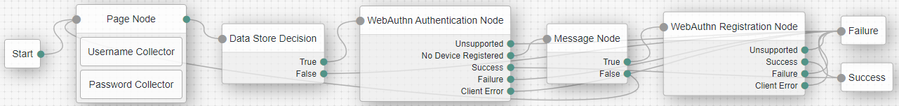
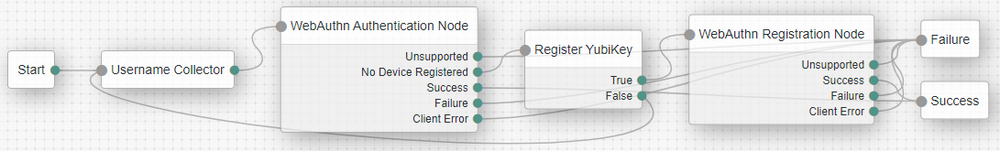
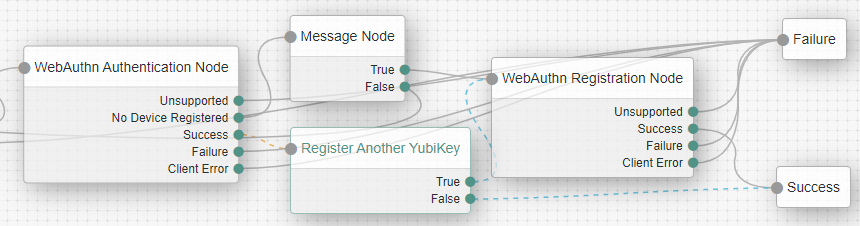
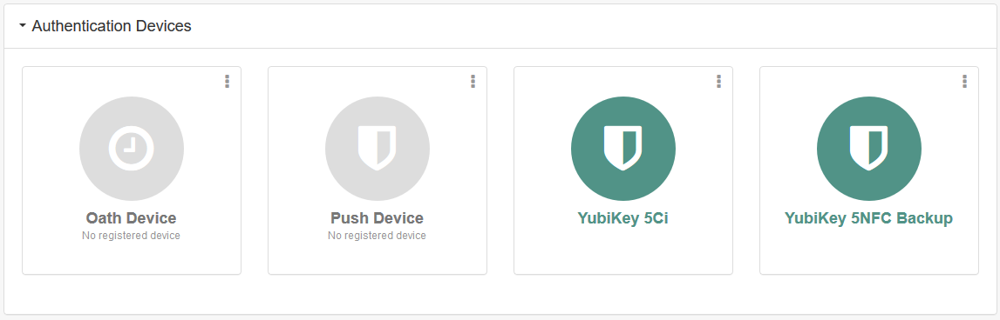

# yubico

Yubico sets new global standards for simple and secure access to computers, servers, and internet accounts. Founded in 2007, Yubico is privately held, with offices in Australia, Germany, Singapore, Sweden, UK, and USA.

Yubico is a leading contributor to the FIDO2, WebAuthn, and FIDO Universal 2nd Factor (U2F) open authentication standards, and the company’s technology is deployed and loved by 9 of the top 10 internet brands and millions of users in more than 160 countries.

## Prerequisites - Supported YubiKeys

* YubiKey 5 series
* Security Key series

## ForgeRock WebAuthn Integration

ForgeRock Access Management supports WebAuthn, enabling FIDO2 hardware devices, such as the YubiKey, for strong authentication.

WebAuthn also offers users greater choice for authentication, including:

* Strong single-factor (YubiKey)
* Two-factor (Password + YubiKey)
* Multi-factor authentication (YubiKey + PIN or Biometric)

With FIDO2 and WebAuthn, ForgeRock Access Management and the YubiKey can replace a username and password with a much stronger form of single factor authentication. FIDO2 and WebAuthn use public-key cryptography and origin  bound key validation instead of passwords or weaker forms of authentication like SMS. The cryptographic security model eliminates the risks of account takeovers from phishing, and all forms of password theft and replay attacks. 

The joint ForgeRock and YubiKey solution also enables expanded use cases, allowing users to also leverage the YubiKey as a second factor for authentication, or combine it with an additional factor, such as a PIN or biometric gesture, to enable strong multi-factor authentication.

Get started with ForgeRock Access Management for YubiKeys:

* [Creating Trees for Web Authentication (WebAuthn)](https://backstage.forgerock.com/docs/am/6.5/authentication-guide/#authn-mfa-web-authn)
* [WebAuthn Authentication Node](https://backstage.forgerock.com/docs/am/6.5/authentication-guide/#auth-node-webauthn-auth)
* [WebAuthn Registration Node](https://backstage.forgerock.com/docs/am/6.5/authentication-guide/#auth-node-webauthn-auth)

## Building YubiKey two-factor (2FA) authentication

This authentication tree will prompt for a username and password then prompt for a YubiKey as a second factor. If the user does not have  YubiKey registered then it will allow them to self-register a YubiKey.

This guide will highlight the specific settings to quickly support YubiKeys for authentication. As this is a quick guide that focuses on the happy path it does not account for robust error handling which would need to be added for a production environment.

Start with a new Authentication Tree. Select your Realm to create the Tree in, then Authentication, then Trees.

Create a new Tree and call it YubiKey2FA, with no spaces.

We will use the following components:

1. Start
1. Page Node
1. Username Collector
1. Password Collector
1. Data Store Decision
1. WebAuthn Authentication Node
1. Message Node
1. WebAuthn Registration Node
1. Success
1. Failure

### WebAuthn Authentication Node - 2FA

The WebAuthn Authentication node allows users of supported clients to use a registered FIDO2 device during authentication.

*Node Mappings:*

* Input --> Data Store Decision (True)
* Unsupported --> Failure
* No Device Registered --> Message Node
* Success --> Success
* Failure --> Failure
* Client Error --> Failure

*Node Settings:*

* User verification requirement: set to DISCOURAGED. This will disable the PIN prompt for WebAuthn. If this was set to PREFERRED or REQUIRED the user will be prompted to enter a PIN before proceeding, this would turn the flow into a form of multi-factor authentication.

Reference [WebAuthn Authentication Node](https://backstage.forgerock.com/docs/am/6.5/authentication-guide/#auth-node-webauthn-auth)

### Message Node - 2FA

Present a message to the user if they do not have a YubiKey registered. If they want to register a YubiKey go to a WebAuthn Registration Node, else go back to collecting username and password. 

*Note:* This was put in as a quick user experience fix for this guide, more complex logic could be used.

*Node Mappings:*

* True --> WebAuthn Registration Node
* False --> Page Node

*Node Settings:*

* Input --> WebAuthentication Node (No Device Registered)
* Message
  * Key: EN_US
  * Value: You do not have a YubiKey registered.
* Positive answer
  * Key: EN_US
  * Value: Register a YubiKey
* Negative Answer
  * Key: EN_US
  * Value: Do not register a YubiKey

Reference [Message Node](https://backstage.forgerock.com/docs/am/6.5/authentication-guide/#auth-node-message)

### WebAuthn Registration Node - 2FA

The WebAuthn Registration authentication node allows users of supported clients to register FIDO2 devices for use during authentication.

*Node Mappings:*

* Input --> Message Node (True)
* Unsupported --> Failure
* Success --> Success
* Failure --> Failure
* Client Error --> Failure

*Node Settings:*

* User verification requirement: set to DISCOURAGED. This will disable the PIN prompt for WebAuthn. If this was set to PREFERRED or REQUIRED the user will be prompted to enter a PIN before proceeding, this would turn the flow into multi-factor authentication.
* Authentication attachment: set to CROSS_PLATFORM. This will instruct the browser to prompt for a YubiKey. If it is set to UNSPECIFIED the user may be prompted for a platform authenticator such as Windows Hello on a Windows 10 device. If not set correctly this may cause the user to unintentionally register a platform authenticator when they thought they were registering a YubiKey.
* Limit registration: set to enabled. This helps the user experience by only being able to register a YubiKey once. If not enabled a user may think they are registering a backup YubiKey, which is a best practice, when they are really registering the same YubiKey again.

Reference [WebAuthn Registration Node](https://backstage.forgerock.com/docs/am/6.5/authentication-guide/#auth-node-webauthn-registration)

### Try out second factor authentication

Open a private browser window and navigate to your environment. At the end of the URL append `#login&service=YubiKey2FA`. Note that "YubiKey2FA" is the name of the Authentication Tree.

Walk through the authentication to see it in action!

## Building YubiKey multi-factor authentication (MFA)

This authentication tree will only prompt for a username then prompt for a YubiKey with a PIN. If the user does not have  YubiKey registered then it will allow them to self-register a YubiKey.

This guide will highlight the specific settings to quickly support YubiKeys for authentication. As this is a quick guide that focuses on the happy path it does not account for robust error handling which would need to be added for a production environment.

Start with a new Authentication Tree. Select your Realm to create the Tree in, then Authentication, then Trees.

Create a new Tree and call it YubiKeyMFA, with no spaces.

We will use the following components:

1. Start
1. Username Collector
1. WebAuthn Authentication Node
1. Message Node
1. WebAuthn Registration Node
1. Success
1. Failure

### WebAuthn Authentication Node - MFA

The WebAuthn Authentication node allows users of supported clients to use a registered FIDO2 device during authentication.

*Node Mappings:*

* Input --> Username Collector
* Unsupported --> Failure
* No Device Registered --> Message Node
* Success --> Success
* Failure --> Failure
* Client Error --> Failure

*Node Settings:*

* User verification requirement: set to REQUIRED. This will enforce the PIN prompt for WebAuthn. If this is set to PREFERRED or DISCOURAGED the user may not be prompted to enter a PIN before proceeding, this would make the flow not  multi-factor authentication.

Reference [WebAuthn Authentication Node](https://backstage.forgerock.com/docs/am/6.5/authentication-guide/#auth-node-webauthn-auth)

### Message Node - MFA

Present a message to the user if they do not have a YubiKey registered. If they want to register a YubiKey go to a WebAuthn Registration Node, else go back to collecting username.

Note: This was put in as a quick user experience fix for this guide, more complex logic could be used.

*Node Mappings:*

* True --> WebAuthn Registration Node
* False --> Username Collector

*Node Settings:*

* Input --> WebAuthentication Node (No Device Registered)
* Message
  * Key: EN_US
  * Value: You do not have a YubiKey registered.
* Positive answer
  * Key: EN_US
  * Value: Register a YubiKey
* Negative Answer
  * Key: EN_US
  * Value: Do not register a YubiKey

Reference [Message Node](https://backstage.forgerock.com/docs/am/6.5/authentication-guide/#auth-node-message)

### WebAuthn Registration Node - MFA

The WebAuthn Registration authentication node allows users of supported clients to register FIDO2 devices for use during authentication.

*Node Mappings:*

* Input --> Message Node (True)
* Unsupported --> Failure
* Success --> Success
* Failure --> Failure
* Client Error --> Failure

*Node Settings:*

* User verification requirement: set to REQUIRED. This will enforce the PIN prompt for WebAuthn. If this is set to PREFERRED or DISCOURAGED the user may not be prompted to enter a PIN before proceeding, this would make the flow not  multi-factor authentication.
* Authentication attachment: set to CROSS_PLATFORM. This will instruct the browser to prompt for a YubiKey. If it is set to UNSPECIFIED the user may be prompted for a platform authenticator such as Windows Hello on a Windows 10 device. If not set correctly this may cause the user to unintentionally register a platform authenticator when they thought they were registering a YubiKey.
* Limit registration: set to enabled. This helps the user experience by only being able to register a YubiKey once. If not enabled a user may think they are registering a backup YubiKey, which is a best practice, when they are really registering the same YubiKey again.

Reference [WebAuthn Registration Node](https://backstage.forgerock.com/docs/am/6.5/authentication-guide/#auth-node-webauthn-registration)

### Try out multi-factor authentication

Open a private browser window and navigate to your environment. At the end of the URL append `#login&service=YubiKeyMFA`. Note that "YubiKeyMFA" is the name of the Authentication Tree.

Walk through the authentication to see it in action!

## Register a backup YubiKey

As a best practice it is recommended for all users to have multiple YubiKeys registered. This is valuable in the event that a YubiKey is lost or forgotten.

This can be demonstrated in the authentication flow by adding a prompt after authentication to register a backup YubiKey.

### Message Node - Register a backup YubiKey

Present a message to the user asking if they would like to register another YubiKey. If they want to register a YubiKey go to a WebAuthn Registration Node, else go to success.

*Node Mappings:*

* Input --> WebAuthentcation Node (Success)
* True --> WebAuthn Registration Node
* False --> Success

*Node Settings:*

* Message
  * Key: EN_US
  * Value: Do you want to register a backup YubiKey?
* Positive answer
  * Key: EN_US
  * Value: Yes
* Negative Answer
  * Key: EN_US
  * Value: No

Reference [Message Node](https://backstage.forgerock.com/docs/am/6.5/authentication-guide/#auth-node-message)

## Renaming or removing a registered YubiKey

Once logged in a YubiKey can be renamed or removed on the following screen:

1. After successfully signing in click on the user profile button on the top of the screen.
1. Click self-service in the drop-down
1. Click Dashboard in the top navigation
1. All the registered YubiKeys will be displayed in the Authentication Devices section
1. To edit a YubiKey click the three dots on the item to get a drop-down menu.
    * To rename the YubiKey select Settings.
    * To remove the YubiKey select Delete.

## Disclaimer

All implied conditions, representations and warranties, including any implied warranty of merchantability, fitness for a particular cause, non-infringement and title with regard to any Yubico product or service, including but not limited to YubiKeys, are disclaimed. In no event does Yubico warrant that the product or service is error free, will operate properly or at all in all computer environments and configurations, or that you will be able to operate the product or service without problems or interruptions. Yubico does not warrant that the product or service or any equipment, system or network on which the product or service is used will be free of vulnerability to intrusion or attack.
